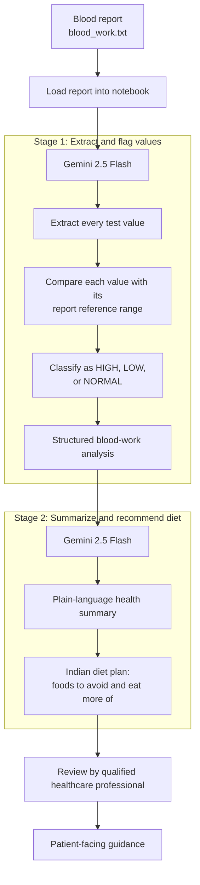

# Blood Work Analysis Workflow



> **Important:** This workflow provides educational, AI-generated information only. A
> qualified healthcare professional must review the analysis before it is used for
> medical decisions.

## Streamlit interface

Run the patient-facing interface from the repository root:

```powershell
uv run streamlit run health-analysis\app.py
```

Paste a blood report into the editor or upload a UTF-8 `.txt` report, then select
**Analyze report**. The app displays the extracted, range-based classifications and
the AI-generated health summary with Indian diet guidance.
